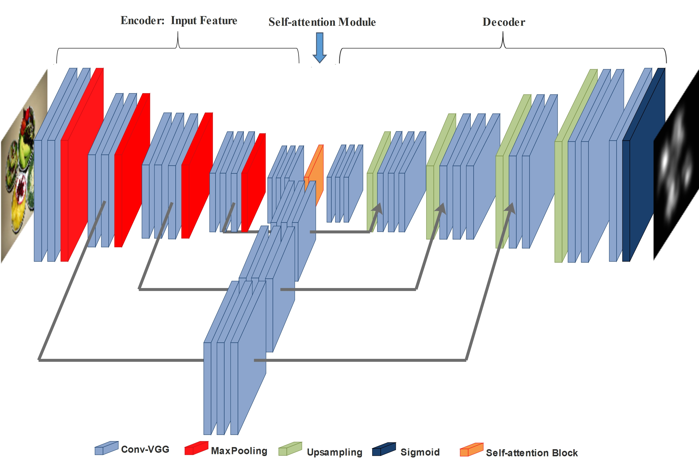

# Saliency
Pytorch Inplementation for paper: "Aggregated Deep Saliency Prediction by Self-attention Network"
# Tidying Deep Saliency Prediction Architectures

This repository contains Pytorch Implementation of VGG-SSM. 

## Abstract

Data-driven method has recently obtained great success on saliency prediction thanks to convolutional neural networks. In this paper, a novel end-to-end deep saliency prediction method named VGG-SSM is proposed. This model identify three key components: feature extraction, self-attention module and multi-level integration. An encoder-decoder architecture is used to extract the feature as a baseline. The multi-level integration construct a symmetric expanding path that enables precise localization. Global information of deep layers is refined by self-attention module which carefully coordinated with fine details in distant portions of a feature map. Each component surely have its contribution, and its efficiency is validated in the experiments. Additionally, In order to capture several quality, the loss function is given by a linear combination of some saliency evaluation metrics. Through comparison with other works, VGG-SSM gains a competitive performance on the public benchmarks, SALICON.

## Architecture
VGG-SSM Architecture

## More details
This code draw lessons from https://github.com/samyak0210/saliencyl.
